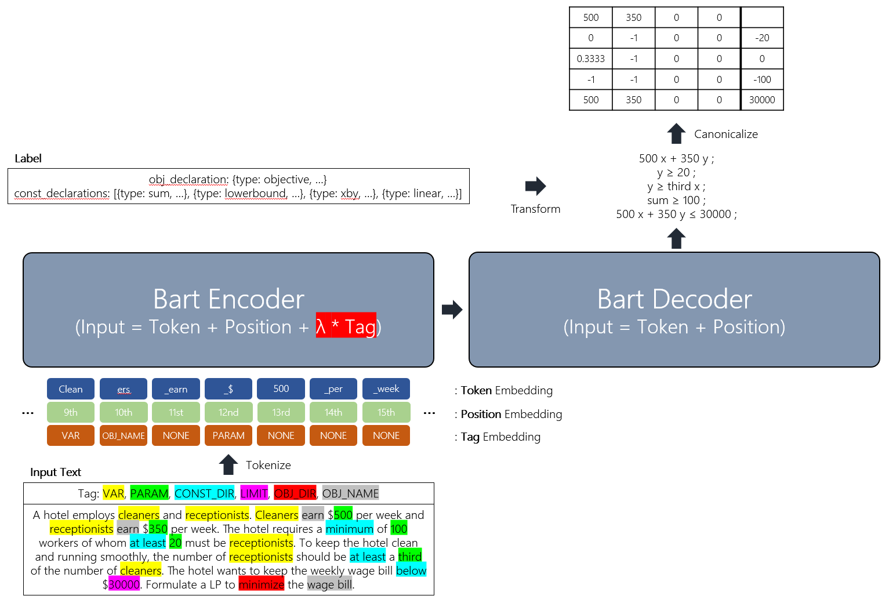

## Check out this [report](https://arxiv.org/abs/2212.03575), [poster](pdfs/Poster.pdf), and [slides](pdfs/Presentation.pdf) for more details!

## [NeurIPS 2022 NL4Opt Competition](https://nl4opt.github.io/)
The Natural Language for Optimization (NL4Opt) NeurIPS 2022 competition aims to improve the accessibility and usability of optimization solvers. The task of converting text description of a problem into proper formulations for optimization solvers can often be time-consuming and require an optimizations research expert. The participants will investigate methods of automating this process to be more efficient and accessible to non-experts. This competition aims to answer the following question: can learning-based natural language interfaces be leveraged to convert linear programming (LP) word problems into a format that solvers can understand?

### **Subtask 1 (NER): Detect problem entities from the problem description.**
The goal of this task is to recognize the label the semantic entities that correspond to the components of the optimization problem. The solutions of the task will take as input an optimization description as a word problem that describes the decision variables, the objective, and a set of constraints.

### **Subtask 2 (Generation): Generate a precise meaning representation of the optimization formulation.**
The goal of this task is to take as input the problem description, the labeled semantic entities, and the order mapping of variable mentions and formulate the precise meaning representation. This meaning representation will be converted into a format that solvers can understand.

## My Solution for Subtask 2 (2nd Place, $3,000)

1. 입력 데이터는 최적화 문제 설명과 개체의 속성(Tag)이고, 레이블은 해당 최적화 문제의 목적(Objective)와 조건(Constraint)이다. 입력 텍스트는 Bart Tokenizer를 이용하여 Encode하며, 레이블은 직접 구현한 코드를 이용하여 수식으로 변환한다. (사전 학습된 Bart 모델에 담긴 정보를 최대한 활용하기 위해, Bart 모델이 이미 학습한 토큰과 문장 구조에 맞게 데이터를 전처리하였다. 그리고 모델 예측의 일관성을 높이기 위해, 최적화 문제 조건 사이의 우선 순위를 정의하였다.)
2. 최적화 문제의 일부 조건을 반대로 수정하여 (e.g., 'must not'을 'must'로 수정) 데이터를 증강한다.
3. Bart 모델의 입력으로 (Token Embedding) + (Position Embedding) + $\lambda$ (Tag Embedding)을 넣고, 이에 대응되는 수식을 생성하도록 학습한다. (Tag Embedding은 0으로 초기화한다.)
4. 생성된 수식을 Canonicalize 하여 최적화 Solver에 넣는다.

## Possible Improvements
1. 학습된 모델이 특정 Tag에 대해 새로운 단어를 포함하거나, 새로운 구조를 가지는 문장에 대해 종종 잘못된 수식을 생성한다. 이를 고려한 데이터 증강 혹은 더 큰 사전 학습 모델 사용을 통해 개선할 수 있다.
